<!--
<h2 align="center">
  Welcome to YASSERAGN World!
  
</h2>
-->

<!--

  

 -->

  

<!-- Intro  -->
<h3 align="center">
        <samp>&gt; Hey There!, I am
                <b><a target="_blank" href="https://www.yasseragn.com">YASSERAGN</a></b>
        </samp>
</h3>

 
  <samp>
    <a href="https://www.google.com/search?q=yasseragn">「 Google Me 」</a>
     
    「 I am a developer, programmer, designer, content creator, blogger, and voice-over From <b>Algeria</b>. My passion for innovation drives me to create impactful and dynamic solutions in every project I undertake. 」
     
       Made with ❤️ In KENDIRA
     
  </samp>

 
 
 <!--  -->
 
  
  

 

<!-- About Section -->
 # About me
 

 
  
 ✌️ &emsp; Enjoy to do programming and sharing knowledge   
 ❤️ &emsp; Passionate about coding elegant solutions that make a real-world impact.s  
 📧 &emsp; Reach me anytime: contact@yasseragn.com  
 💬 &emsp; Ask me about anything [here](#)

## نبذة عن اضافة `YASSERAGN AADL3 Inscription Helper with Telegram Alert`
هذه الإضافة مفتوحة المصدر تقوم بمساعدتك في التسجيل في موقع **AADL3** , و تمكنك من تقليل الوقت في ملئ البيانات و ترسل لك تنبيهات عبر التلجرام عند حدوث اي تغيير  مع لقطة شاشة عند التسجيل بنجاح و تمتللك ايضا خاصية ارسال اشعار صوتي عبر المتصفح عند حدوث تغيير في الموقع 

# مميزات `الإضافة` 
- يتم تسجيلك تلقائيا عند ادخال المعلومات المطلوبة في الإضافة (**اختيار ولاية الاقامة** , **ادخال رقم التعريف الوطني** ,**ادخال رقم الضمان الإجتماعي** ,**ادخال رقم الهاتف** ).  
- تقوم الإضافة بعمل تحديث للصفحة حتى يستيجب الموقع.  
- تحتوي على خاصية ارسال **اشعار** عبر بوت تلجرام عندما تكون صفحة التسجيل جاهزة مع معلومات التسجيل.  
- تقوم بإرسال رسالة عبر البوت مع **لقطة شاشة** عند نجاح عملية التسجيل. 
- يمكنك **تفعيل** بوت التلجرام او يقافه.  
- ادخال معلومات بوت التلجرام **اختيارية** اي يمكنك ان تشغل الإضافة بدون ادخال معلومات البوت.  
- ارسال **اشعار صوتي** في المتصفح عندما تكون صفحة التسجيل جاهزة.  

## تم برمجة الإضافة و تطويرها بواسطة 

 
> [!CAUTION]
> الغرض من هذه الإضافة هو تقليل الوقت المستغرق على **الموقع** من خلال التمكين من الملء التلقائي وتقليل معدلات الأخطاء أثناء الكتابة. تحاكي الإضافة الإجراءات البشرية في التحديث والملء، معتمداً على واجهة برمجة التطبيقات العامة لامتداد Chrome، مما يعزز تجربة التصفح بشكل كبير. هذا الإضافة تعمل بشكل مستقل ولا تتواصل مع الموقع بأي شكل، كما لا تحاول استغلال أي ثغرة أمنية.

# `كيفية إنشاء بوت Telegram` والحصول على TELEGRAM_TOKEN و CHAT_ID
إنشاء بوت <b> Telegram </b>:  
 
1- افتح تطبيق **Telegram** وابحث عن المستخدم <a href='https://t.me/BotFather'>@BotFather</a>.  
2- ابدأ محادثة مع @BotFather وأرسل الأمر /start. 
3- لإنشاء بوت جديد، أرسل الأمر /newbot.  
4- اتبع التعليمات لتسمية البوت والحصول على اسم مستخدم (username) فريد له.
بعد إكمال الخطوات، ستحصل على رمز توكن البوت (API token). هذا هو TELEGRAM_TOKEN. 
 
الحصول على <b> CHAT_ID </b> :  
1- افتح تطبيق **Telegram** وابحث عن المستخدم <a href='https://t.me/my_id_bot'>@my_id_bot</a>  
2- ابدأ محادثة مع @What's my Telegram ID? وأرسل الأمر /start. 
3- سوف تتحصل على chat id و هو عبارة عن ارقام فقط.  

## تثبيت الإضافة في `الهاتف` 
1- أولاً، قم بتحميل المشروع  من  Github: Code > Download ZIP. , **لا تفك الضغط على الملف**.  
 

  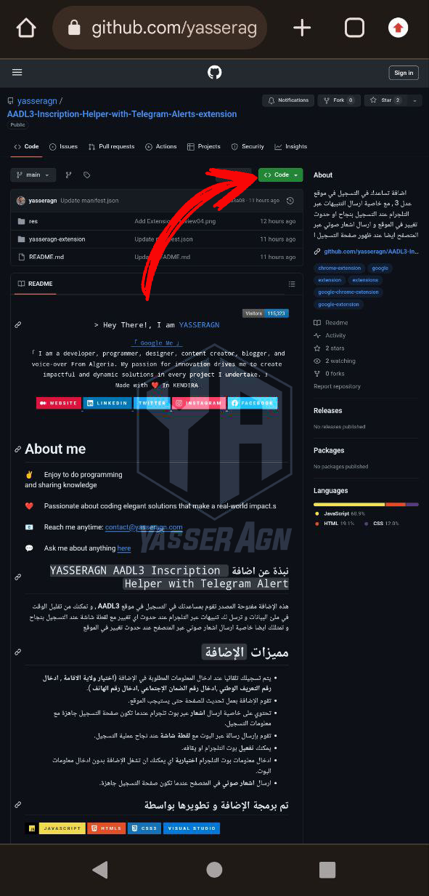 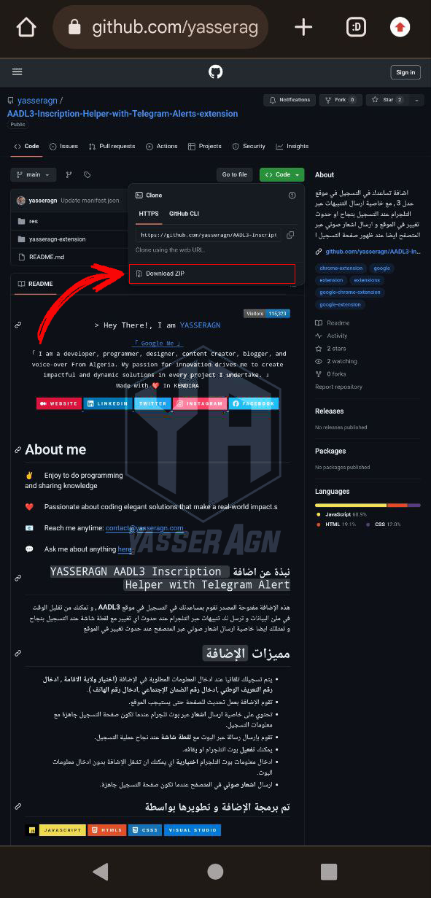

 

2- حمل تطبيق <a href='https://play.google.com/store/apps/details?id=com.kiwibrowser.browser&hl=en&pli=1'>Kiwi Browser<a/> من متجر بلاي.  
3- بعد تثبيت التطبيق اضغط على ثلاث نقاط الموجودة في يمين التطبيق.  

  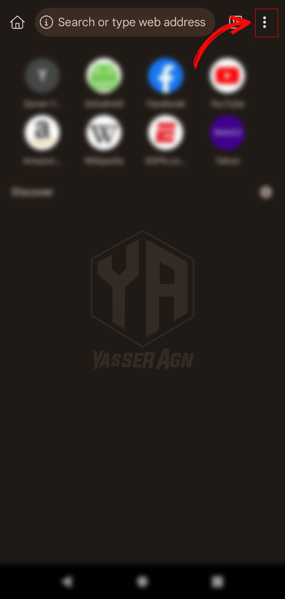

 

4- اضغط على خيار Extension.  

  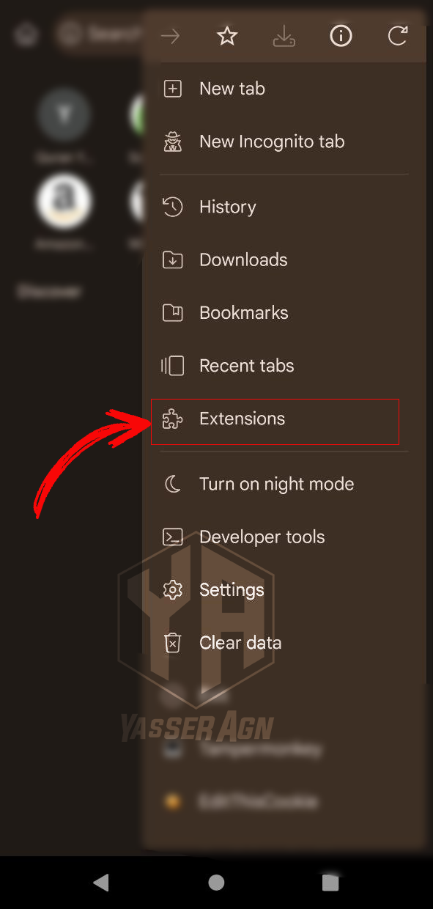

 

5- فعل زر Developer Mode.  

  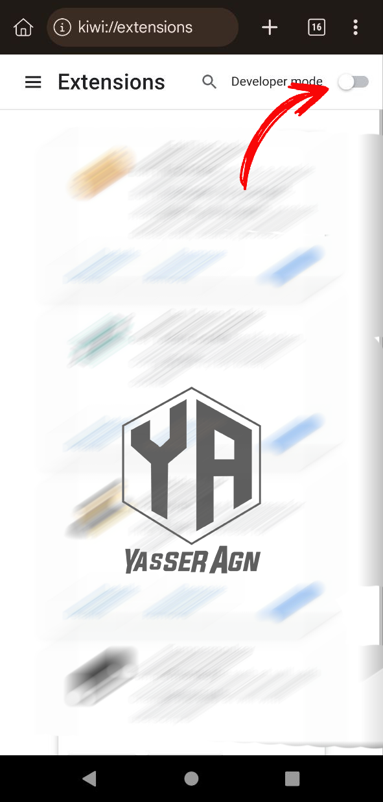

 

6- اضغط على الخيار <b>(from .zip/.crx/.user.js)</b>.  

   

  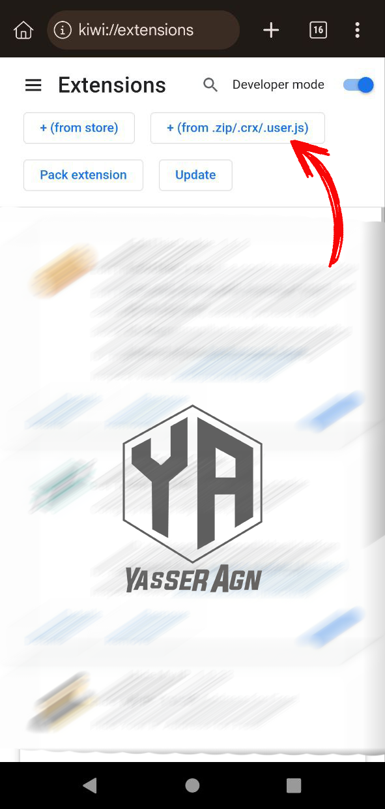

 

7- اختر الملف <b> zip </b> الذي حملته.  

   

  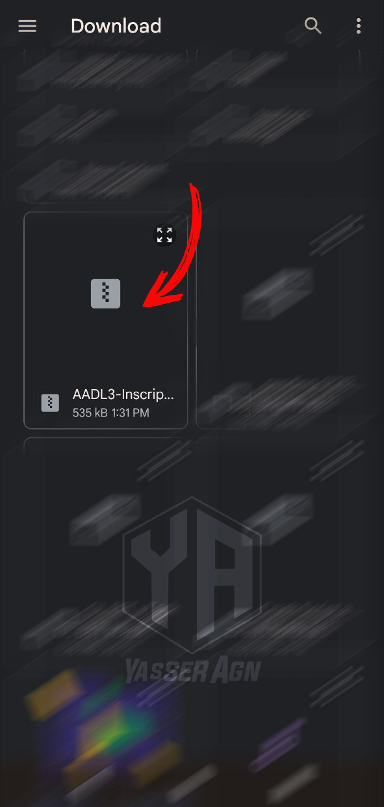

 

8- الان بقي فقط تشغيل التطبيق , اضغط  <b>على ثلاث نقاط </b> الموجودة في يمين التطبيق , و انزل تحت سوف تجد الاضافة مثبت بنجاح ثم اضغط على الاضافة.  

   

  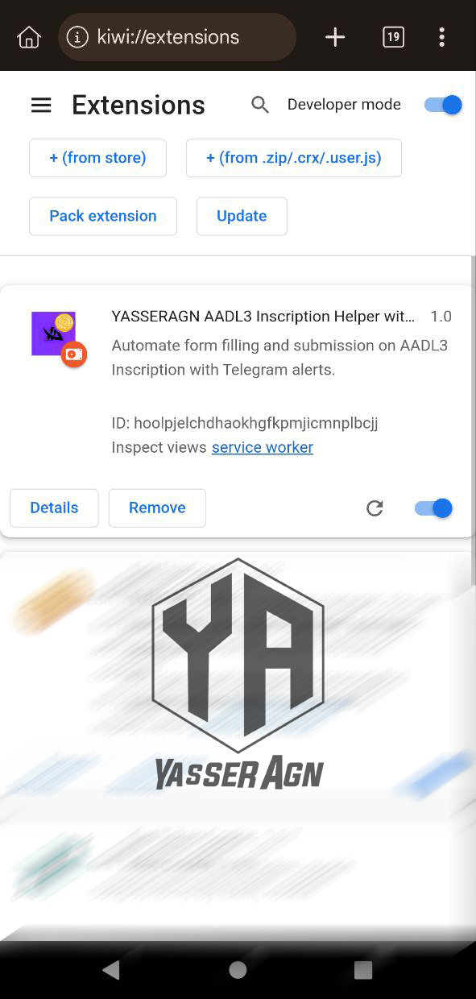  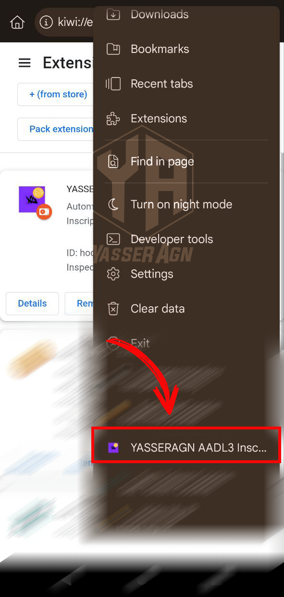

 

9- سوف تفتح الاضافة , و املئ <b> المعلومات الضارورية </b>.  

   

  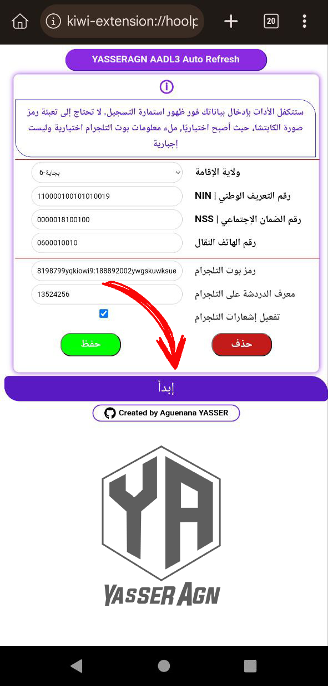

 

10- اضغط على <b> ابدأ </b> و سوف تفتح صفحة جديدة و تبدأ الاضافة في الاشتغال.  

   

  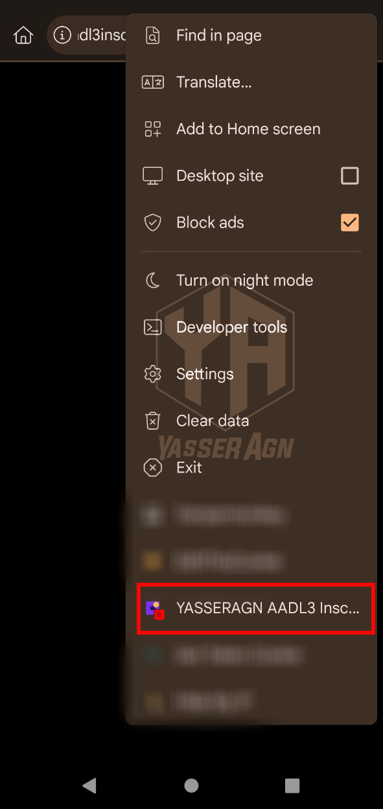

 

## طريقة استخدام `الإضافة` في الحاسوب 
1- أولاً، قم بتنزيل المشروع وفك ضغطه من صفحة Github: Code > Download ZIP.   
2- ابحث عن ملف yasseragn-extension.  
3- اذهب الى متصفح جوجل و اضغط على الثلاث نقاط الموجودة في يمين الصفحة.  
 

  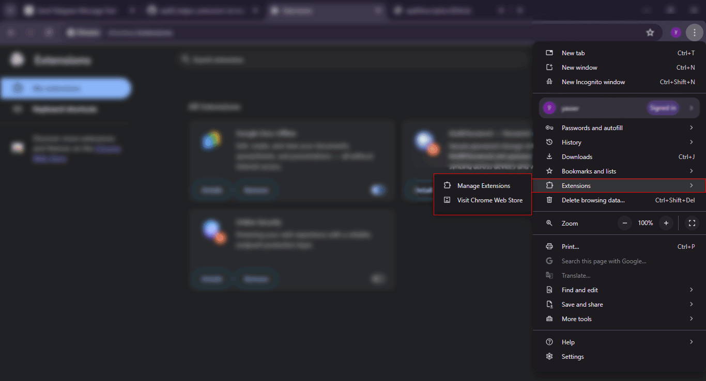

 

4- ابحث عن كلمة **Extensions** ثم اضغط على Mange Extensions.  
5- فعل زر Developer mode.   
6- اضغط على **Load unpacked** و اختر مسار اين قمت بفك ضغط على الملف الذي حملته ثم اختر ملف **yasseragn-extension** و اضغط على Select Folder.  
 

  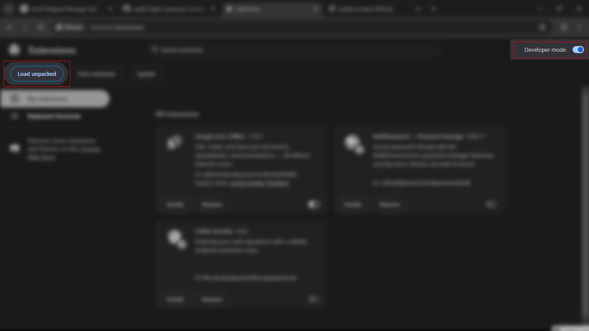

 

7- اضغط على الاضافة و قم بملئ المعلومات المطلوبة في الإضافة , و اما في الجزء الخاص ببوت التلجرام اضف الملعومات المطلوبة و اضغط على حفظ.  

  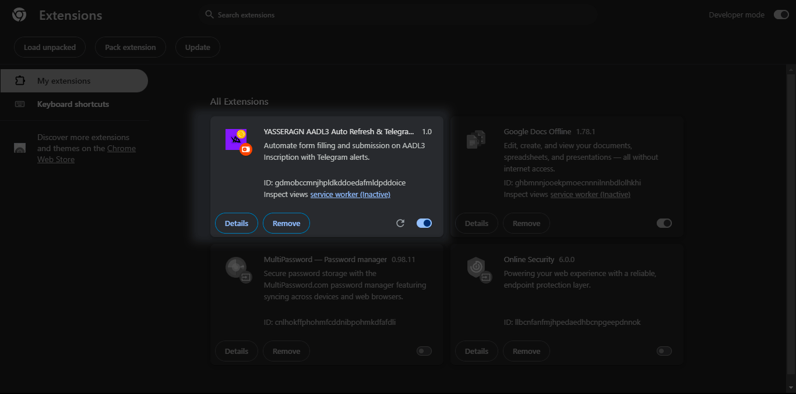

8- بعد ملئ المعلومات اضغط على **ابدأ** لتشغيل الادات. 
 

  

 

9- زر **الحفظ** يتحكم بجزء الخاص ببوت التلجرام فقط مع زر **الحذف** ايضا.  

## :man_astronaut: Show your support

Give a ⭐️ if this project helped you!      
